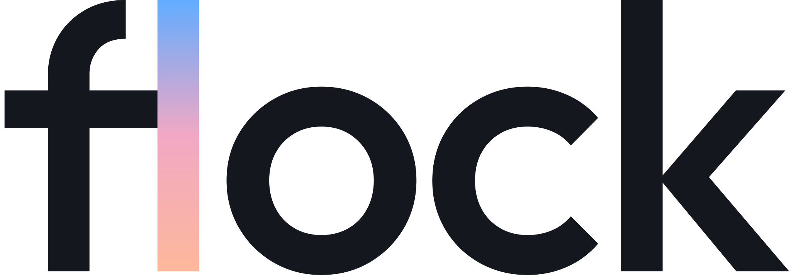
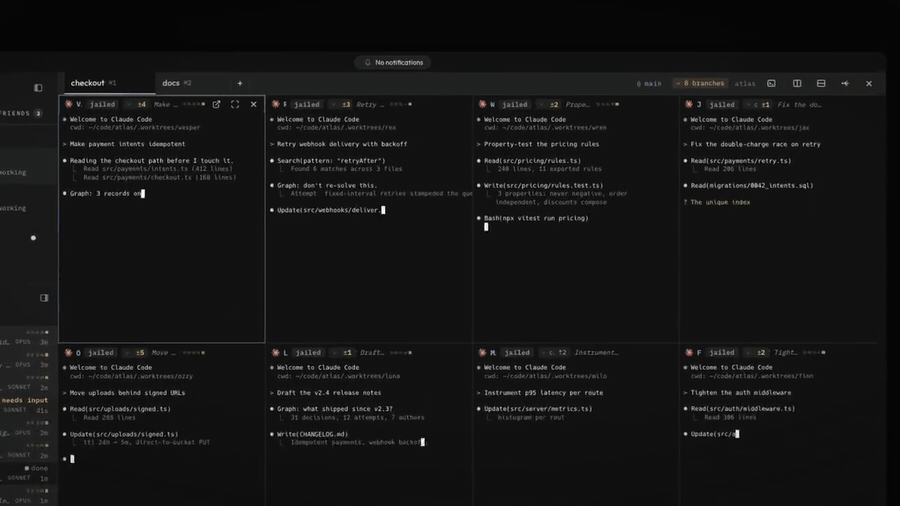
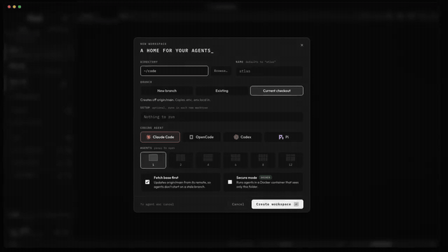
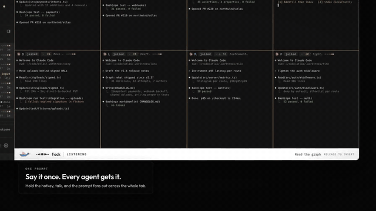
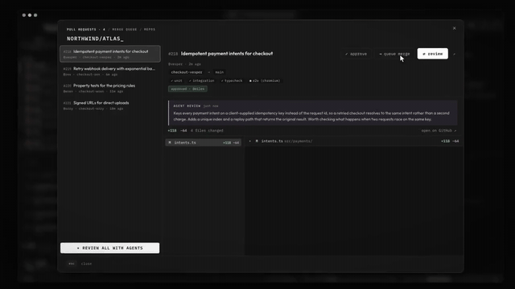
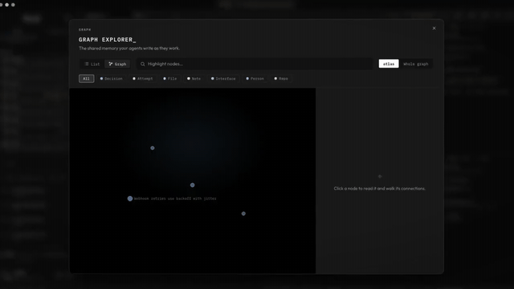
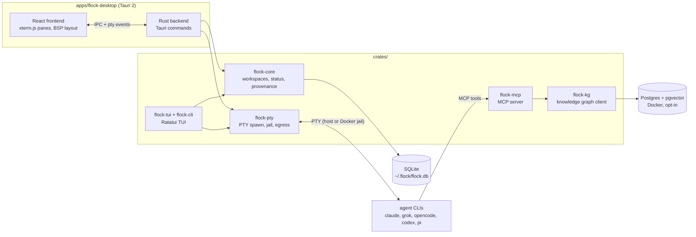
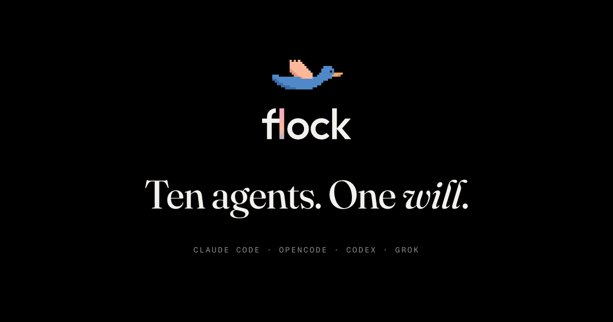

<p align="center">
  
</p>

<p align="center">
  <picture>
    <source media="(prefers-color-scheme: dark)" srcset="docs/assets/wordmark-dark.svg">
    
  </picture>
</p>

<p align="center"><b>the agentic development environment</b><br>
your coding agents, in formation</p>

<p align="center">
  <a href="LICENSE"></a>
  
  <a href="https://github.com/theflock-labs/flock-code/releases"></a>
  <a href="https://github.com/theflock-labs/flock-code/stargazers"></a>
</p>

<p align="center">
  
</p>

<p align="center">
  
</p>

<p align="center">
  <a href="https://theflock.sh/videos/flock-launch.mp4"><b>Watch the launch film</b></a> (two minutes) ·
  <a href="https://theflock.sh">theflock.sh</a>
</p>

flock is a multi-agent coding cockpit: a desktop app that runs multiple AI
coding agents (Claude Code, Grok, opencode, Codex, Pi) side-by-side in tiled
terminal panes, over a SQLite-backed workspace manager and an opt-in shared
knowledge graph. It exists because coding agents got good enough that one
person can run several at once, but the tools still assume you are babysitting
a single terminal. Running a room full of agents should feel like flying one
plane, not juggling ten. And when you quit and reopen, the room is exactly
where you left it.

flock is free and open source under Apache-2.0. There are no paid tiers.
Agents run on your own CLI logins and your own model spend; flock is the
cockpit around them, not a reseller of tokens. Signing in with Google (a flock
ID) is required to use the app.

## What you get

- **Tiled agent panes.** Workspaces and tabs over a BSP split layout with grid
  presets (1/2/4/6/8/12 panes). Panes zoom, pop out to their own window, and
  can receive broadcast input across a tab. Each pane shows the agent's live
  status, and the titlebar counts the agents that are blocked waiting on you.
- **Races across git worktrees.** Fan out N agents on the same prompt, each in
  its own worktree cut from one commit. Compare every contender's diff against
  that commit side by side, merge the winner, and discard the rest, with the
  losers' work committed first so nothing is force-deleted.
- **Secure mode.** Each agent runs in a per-workspace Docker jail that sees
  the workspace folder and nothing else of your machine: no SSH keys, no
  keychain, no other repos. That is what makes flock's default
  bypass-permissions launch flags defensible. On by default wherever Docker is
  running, fails closed rather than quietly giving you a host shell, and once
  a workspace is secure the backend refuses to downgrade it.
- **Egress control.** Opt-in per-workspace network restriction: jailed panes
  join an internal Docker network whose only way out is a CONNECT-only,
  allowlist-checked proxy. No default route, no plain HTTP, no names that
  resolve into private ranges.
- **Knowledge graph.** Opt-in shared memory (Postgres + pgvector) that agents
  write decisions and attempts to over MCP, with per-prompt grounding injected
  by a hook. Its metrics are windowed and able to fall (coverage, silent
  passes, recall volume), and the app says on screen what has not been
  measured.
- **Per-pane context meters.** A live bar per Claude Code and Grok pane
  showing how full that conversation's context window is, read from the
  pane's own transcript.
- **Budgets and cost attribution.** Spend is attributed per session id, rolled
  up to workspaces and repos, with per-workspace and machine-wide daily
  ceilings that alert as they are approached. Token counts are exact; dollar
  figures are estimates from a local price table and every surface says so.
- **Provenance export.** One durable record per agent session (who ran it,
  where, for how long, how many prompts, what it cost), exportable as CSV or
  JSON. Prompt text, agent output, and diffs are never stored, and there is no
  flag that turns them on.
- **And the rest.** GitHub integration (PR list, checks, one-click review
  agents), on-device voice dictation, per-workspace accent colors, a ⌘K
  command bar, signed auto-updates, and a Ratatui TUI (`flock-cli`) sharing
  the same core engine.

## In motion

<table>
  <tr>
    <td width="50%">
      
      <p align="center"><b>A home for your agents.</b><br>Directory, branch strategy, agent, grid, and secure mode: on by default when Docker is running.</p>
    </td>
    <td width="50%">
      
      <p align="center"><b>Say it once. Every agent gets it.</b><br>Hold the hotkey, talk, and the prompt fans out across the whole tab.</p>
    </td>
  </tr>
  <tr>
    <td width="50%">
      
      <p align="center"><b>The round trip, without leaving the window.</b><br>Checks, reviews, the agent's own summary and the diff, per PR.</p>
    </td>
    <td width="50%">
      
      <p align="center"><b>Every decision and dead end, written down.</b><br>Agents read it before they work, so nobody re-solves a solved problem.</p>
    </td>
  </tr>
</table>

## Getting started

### Download

Grab the DMG from [theflock.sh](https://theflock.sh) or the
[GitHub releases page](https://github.com/theflock-labs/flock-code/releases).
Builds are signed, notarized, and auto-update in the background.

flock ships for **macOS on Apple Silicon only** today. There are no Windows or
Linux builds, and cross-platform support is not currently committed: the
Rust workspace is portable, but the app is only built, tested, and released
as a macOS DMG.

### Build from source

Prerequisites: macOS, Xcode Command Line Tools, stable
[Rust](https://rustup.rs), Node 20+ with npm.

```bash
git clone https://github.com/theflock-labs/flock-code.git
cd flock-code

# One-time: build the flock-mcp sidecar the app bundles (it is gitignored)
cargo build --release -p flock-mcp
mkdir -p apps/flock-desktop/src-tauri/binaries
cp target/release/flock-mcp \
  "apps/flock-desktop/src-tauri/binaries/flock-mcp-$(rustc -vV | sed -n 's/host: //p')"

cd apps/flock-desktop
npm install
npm run tauri dev      # development, with hot reload
npm run build          # production bundle
```

The TUI needs only Rust:

```bash
cargo run -p flock-cli
```

### First run

1. **Sign in with Google.** flock requires a flock ID; the app gates on it.
2. **Create a workspace.** Point it at a git repository, pick a pane layout,
   and choose an agent kind. If Docker is running, secure mode is on by
   default. Leave it on.
3. **Spawn agents.** Each pane launches the agent CLI you chose. The agent
   CLIs are not bundled: `claude`, `grok`, `opencode`, `codex`, or `pi` must
   be installed on your machine and signed in to their own accounts. flock
   never handles your model credentials beyond passing them to the agent.

### Optional pieces

- **Secure mode** needs [Docker Desktop](https://www.docker.com/products/docker-desktop/).
  Without a Docker daemon, workspaces run agents directly on the host. Read
  the [security model](#security-model) before deciding that is acceptable.
- **The knowledge graph** needs Docker too. Enable it from the in-app setup
  wizard, which starts the Postgres + pgvector engine and wires new panes with
  the `kg.*` MCP tools. Two things the wizard also tells you: jailed panes do
  not get the graph tools (the MCP server is a host binary), and panes are
  wired at spawn, so open a new pane after enabling.

## Security model

flock runs coding agents with their permission prompts turned off. That is
the product, and the only thing that makes it defensible is that by default
the agent is not on your Mac. The short version, stated honestly:

- **Secure mode is a real jail.** Each pane is a Docker container with
  `--cap-drop ALL`, `no-new-privileges`, a pid limit, a non-root user, no
  Docker socket, and the stock seccomp profile. It sees the workspace
  directory (read-write), a per-workspace volume as `$HOME`, a per-workspace
  transcript directory, its own hook log, and the one API key belonging to
  its own agent. It never sees SSH keys, the Keychain, your other repos, your
  browser profile, or `~/.flock`. `<repo>/.git/hooks` is masked read-only so
  a jailed agent cannot plant a hook your own git would later run on the
  host. Secure mode fails closed: no Docker, no pane.
- **Host mode is not a sandbox.** Without Docker, an agent with prompts
  disabled can do anything your user can. The New Workspace dialog says so in
  those words. If you are deploying flock in an organisation, require Docker
  and treat host mode as out of policy.
- **The jail does not stop exfiltration of the workspace itself.** The agent
  has the repository and, by default, a network; in the worst case it can
  describe the source to its own model API. If a repository is too sensitive
  to be read by a third-party model, it is too sensitive for any agent tool,
  flock included. Treat a checkout after a secure session as untrusted input
  and review the diff.
- **Egress control closes the easy channels.** Opt-in per-workspace: panes
  join an internal Docker network with no default route, and the only way out
  is a CONNECT-only, port-443-only, allowlist-checked proxy that terminates
  no TLS and refuses names resolving into private ranges. Verified against a
  live daemon: allowlisted hosts connect, unlisted ones are refused, bypassing
  the proxy finds no route, and `host.docker.internal` no longer resolves.
  An allowlist bounds who the agent can talk to, never what it can say.
- **The webview is not trusted with security decisions.** Agent commands are
  allowlisted backend-side, launch-hijacking env keys are blocked, the
  working directory is validated, a secured workspace refuses to downgrade,
  and the egress policy is read from a host file rather than over IPC.
- **Known limits.** `host.docker.internal` reaches host loopback services
  unless egress control is on; the sandbox image installs agent CLIs from npm
  unpinned; there are no memory/CPU limits (pid limit only); container-escape
  vulnerabilities in Docker itself are out of scope. Keep Docker Desktop
  updated.

Report security issues privately through GitHub's security advisories for
this repository, not as public issues. If a claim in this section is wrong,
that is itself the report we most want.

## Architecture



The frontend renders each pane with xterm.js and talks to the Rust backend
over Tauri commands. `flock-pty` spawns each agent CLI under a PTY (on the
host, or inside a Docker container in secure mode) and streams output back as
events; the same byte stream feeds per-agent status detection. `flock-core`
owns persistence: workspaces, layouts, and the provenance record in SQLite
under `~/.flock`. The knowledge graph is a separate opt-in engine (Postgres
with pgvector in Docker) that agents reach through the `flock-mcp` server.

## Contributing and community

- [GitHub Discussions](https://github.com/theflock-labs/flock-code/discussions)
  for questions and ideas
- [Issues](https://github.com/theflock-labs/flock-code/issues): bugs and
  concrete feature requests
- Pull requests are welcome. Before opening one: `npx tsc --noEmit` and
  `npx vitest run` in `apps/flock-desktop`, and `cargo check` at the root,
  all green. Keep changes scoped; say what you verified and how.
- Security issues go through
  [private vulnerability reporting](https://github.com/theflock-labs/flock-code/security/advisories),
  never a public issue.

## License

Apache License 2.0. See [LICENSE](LICENSE).

Copyright 2026 the flock authors.

<p align="center">
  <a href="https://theflock.sh"></a>
</p>
